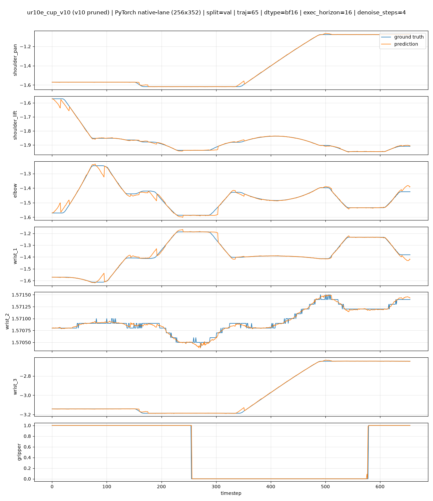
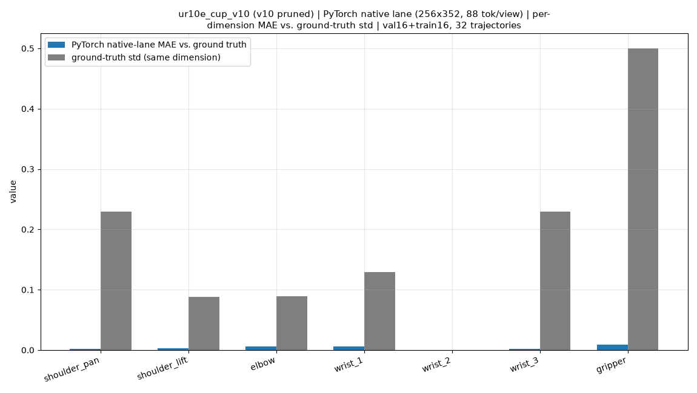
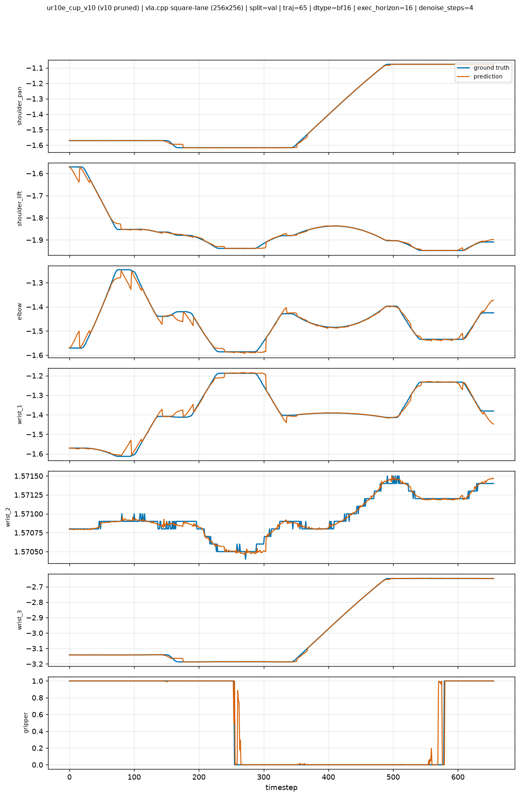
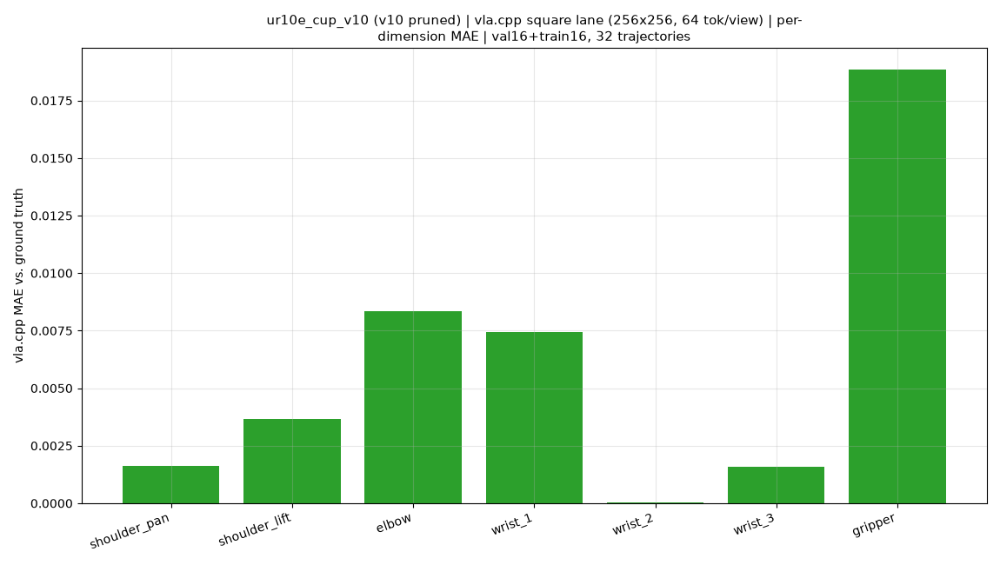

# Open-Loop Evaluation Report: UR10e Cup-Pickup GR00T N1.7 (v10 pruned) via the vla.cpp C++ Engine

## 1. Scope

| | |
|---|---|
| Checkpoint | `Yin142/ur10e_cup_v10` (v10 pruned GR00T N1.7) |
| Pruning | backbone (Qwen3 LM) layers kept `[0,1,9,15]`; DiT layers kept `[0,1,2,3]`; VL self-attention layers kept `[0,2]` -- **4/4/2** |
| Parameters | **1,491,930,240** = **43.2%** of the unpruned GR00T N1.7-3B base, fp32 |
| Dataset | `khanhnd61/ur10e-cup` -- LeRobot v3.0, converted to v2.1 for this harness |
| Episodes / frames | 81 episodes / 49,779 frames / 20 fps, 480x640 AV1, single task ("pick up the cup") |
| Val split (`VAL16`) | `episode_index` 65-80 (16 episodes) |
| Train split (`TRAIN16`) | `episode_index` `[2, 3, 5, 6, 8, 14, 15, 17, 27, 34, 37, 43, 47, 57, 62, 64]` (seed 42) |
| Action horizon (predicted chunk) | 40 |
| Execution horizon (open-loop stride) | 16 |
| Denoising steps (flow-matching Euler) | 4 |

Pruning details are tracked by the checkpoint author (`PRUNING_RESULTS.md`, not
part of this repository). This report gives the open-loop MAE/MSE for two
engines, each in the image configuration it actually runs:

- **PyTorch reference** (Isaac-GR00T), native image lane: 256x352, aspect
  ratio preserved, 88 tokens/view.
- **vla.cpp** (GGUF port, `vla-server`), square image lane: 256x256,
  letterbox-padded, 64 tokens/view -- the configuration the C++ engine
  currently supports (see §2).

This is an **open-loop** evaluation: predicted actions are
compared against recorded dataset actions at fixed inference points. No
simulator is used, so this report does **not** measure task success rate.

## 2. What was ported

The vla.cpp C++ inference core (`gr00tn1d7.cpp`) is **unchanged** by this work.
What was built for this checkpoint:

- A GGUF converter path for the pruned checkpoint, requiring four changes
  beyond the existing unpruned `gr00t_n1_7` support:
  1. **Layer counts derived from the state_dict, not the config.** The
     checkpoint's `config.json` still declares the pre-prune architecture (32
     LM layers, 32 DiT layers, 4 VL self-attention layers). The converter now
     counts actual layer indices present in the `state_dict` instead of
     reading them from `config.json`.
  2. **Sidecar files read from `processor/`, fail-loud.** Dataset-statistics
     and processor sidecars were previously read from a stale default path
     and silently fell back to an empty `"{}"` on a missing file. The
     converter now reads from `<ckpt>/processor/` and raises on failure.
  3. **`select_layer` overwritten to the post-prune layer count**, mirroring
     `qwen3_backbone.py:290` (`hungho77/Isaac-GR00T@yennt`):
     `self.select_layer = len(kept_layer_idx_list)`.
  4. **`use_relative_action` read from the processor, not `config.json`.**
     This key is **absent** from `config.json` for this checkpoint; the
     correct value (`True` -- `single_arm` is relative, `gripper` is
     absolute) only exists in `processor/processor_config.json`'s
     `processor_kwargs.use_relative_action`.
- An open-loop evaluation harness, `eval/client/run_open_loop_gr00t.py`
  (commit `6262232`).

What did **not** change: `gr00tn1d7.cpp`'s kernels, `vla_cpp_client.py`'s
request/response plumbing, and Isaac-GR00T's own evaluation code (reused
unmodified, see §3).

vla.cpp does not currently run the checkpoint's native 256x352 image pipeline
-- `gr00tn1d7.cpp` was ported assuming a fixed square input (matching the
LIBERO/robosuite convention the original `gr00t_n1_7` GGUF support was built
against): `build_caches()` fixes a single square `grid x grid` at GGUF load
time, `preprocess_image_patches()` rejects any non-square image, and the
converter hardcodes `n_img_tokens_per_view = 64`. vla.cpp's client-side
`_gr00t_eval_image_transform` (`vla_cpp_client.py`) letterbox-pads the
480x640 source frames to 640x640 before resizing to 256x256, so the two
engines below are evaluated on genuinely different images, not just a
different resize kernel on the same crop. Because the two rows in §4 run
different image pipelines, this report does not compute a ratio or
percentage difference between them -- each engine's numbers are a result in
their own right, not a comparison.

## 3. Method

`eval/client/run_open_loop_gr00t.py` reuses Isaac-GR00T's own
`evaluate_single_trajectory` unmodified, via a `VlaCppPolicy` adapter
(`BasePolicy` subclass) wrapping a `Gr00tUR10eClient` (`VlaCppClient`
subclass). No chunk-stitching, MAE/MSE, or plotting logic is re-implemented --
only `policy.get_action(parsed_obs)` is supplied.

Action unnormalization (traced directly from
`gr00t/data/state_action/state_action_processor.py`,
`hungho77/Isaac-GR00T@yennt`): `single_arm` is
`ActionRepresentation.RELATIVE` -- the relative-action override at
`state_action_processor.py:201` copies the entire
`relative_action.single_arm` stats blob (not the absolute `action` stats)
into the normalization parameters, bypassing the global `use_percentiles`
flag, so unnormalization uses the literal min/max fields, indexed per horizon
step (16 separate `(min, max)` pairs). The per-step delta is added to the
**current** state (one reference state broadcast across all 16 steps --
`JointActionChunk.to_absolute_chunking`, `action_chunking.py:384`, not a
running per-step integration). `gripper` is `ActionRepresentation.ABSOLUTE`
and takes the normal `use_percentiles=True` path: literal q01/q99, no state
addition.

Both engines were run on the same checkpoint, the same dataset, and the same
32 trajectories (16 val + 16 train). Full per-trajectory MAE/MSE for both
engines are in
[`assets/gr00tn1d7_ur10e/eval_results.csv`](assets/gr00tn1d7_ur10e/eval_results.csv).

## 4. Results

### 4.1 PyTorch reference, native image lane

256x352 input resolution, aspect ratio preserved, 88 tokens per camera view
(Isaac-GR00T's own `eval_image_transform`, `letter_box_transform: false`).

| Split | MAE | MSE | n |
|---|---:|---:|---:|
| val | **0.003726** | **0.001054** | 16 |
| train | **0.003864** | **0.001479** | 16 |

**Plot 1 -- ground truth vs. prediction, val trajectory 65:**

**Plot 3 -- per-dimension MAE vs. ground-truth std, val16+train16 (32 trajectories):**

### 4.2 vla.cpp, square image lane

256x256 input resolution, letterbox-padded, 64 tokens per camera view -- the
configuration `gr00tn1d7.cpp` currently supports (§2).

| Split | MAE | MSE | n |
|---|---:|---:|---:|
| val | **0.005857** | **0.002389** | 16 |
| train | **0.005964** | **0.002730** | 16 |

**Plot 2 -- ground truth vs. prediction, val trajectory 65:**

**Plot 4 -- per-dimension MAE, val16+train16 (32 trajectories):**

