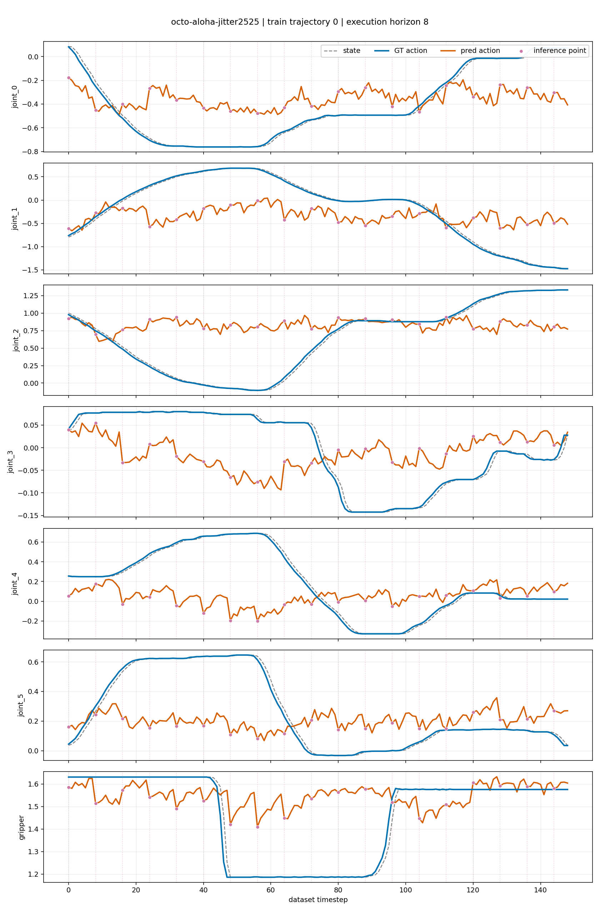

# Open-Loop Evaluation Report: Jitter-Adapted Octo (step 2525) via the vla.cpp C++ Engine

Evaluation date: **2026-08-04**
Status: **complete**

## 1. Objective

This report presents an open-loop evaluation of the fine-tuned Octo L1/proprio
checkpoint `one_episode_ep0_jitter1cm_command_v4_adapt` (checkpoint step
`2525`), run through the **vla.cpp C++ inference engine** (GGUF checkpoint,
`head_type=l1` action head + proprio tokenizer, served over `vla-server`)
rather than the original PyTorch model. The objective is to determine whether
the C++ engine reproduces the checkpoint's published open-loop numbers
(computed with the original PyTorch model, `octo-pytorch-kamusarj`) closely
enough to trust it as a drop-in inference replacement. This is not a
simulation rollout and does not measure task success.

## 2. Protocol

The protocol was adapted from:

- [Isaac-GR00T: Step 4 — Open Loop Evaluation](https://github.com/NVIDIA/Isaac-GR00T/blob/main/getting_started/finetune_new_embodiment.md#step-4-open-loop-evaluation)
- [NVIDIA `gr00t/eval/open_loop_eval.py`](https://github.com/NVIDIA/Isaac-GR00T/blob/main/gr00t/eval/open_loop_eval.py)

At each inference point, the evaluator (`eval/client/run_open_loop_octo.py`):

1. retrieves the ground-truth observation at that RLDS trajectory step (top
   camera 256², wrist camera 128², raw 7-D proprioceptive state, language
   instruction);
2. sends the observation to `vla-server`, which runs the head_type=l1 GGUF
   checkpoint end-to-end (proprio z-score normalization, obs tokenizers, T5
   language encoder, block transformer, MAPHead action head) on the ggml CPU
   backend;
3. receives a predicted `(20, 7)` action chunk, already un-normalized to
   original units server-side;
4. takes the first `execution_horizon = 8` actions from the chunk;
5. concatenates the predicted chunks over time;
6. compares them with the corresponding ground-truth actions;
7. computes MAE, MSE, and RMSE over valid action values;
8. saves a GT-vs-prediction plot and a NumPy trace for auditing.

The observations always come from the recorded dataset trajectory
(teacher-forced). Predicted actions are not fed back into a simulator or used
to generate subsequent observations. The results therefore measure action
imitation quality only, reproduced through a different (C++/ggml) inference
engine than the one used to produce the published numbers.

The `original_units` metrics are computed after reversing the checkpoint's
normalization (z-score, `octo.dataset_statistics.action`). The first six
dimensions are joint actions, and the final dimension is the follower-gripper
command. The `normalized` metrics are retained for normalization debugging.

## 3. Evaluation Configuration

| Engine | Checkpoint | Evaluation dataset | Window | Action horizon | Execution horizon |
|---|---:|---|---:|---:|---:|
| vla.cpp (ggml, CPU) | 2525 | `aloha_carrot_easy_rlds` | 1 | 20 | 8 |

The GGUF checkpoint was converted from the same PyTorch checkpoint
(`one_episode_ep0_jitter1cm_command_v4_adapt`, step 2525) used to produce the
published numbers, via `scripts/convert_octo_to_gguf.py`. Both the
vla.cpp run and the published PyTorch run use the same original RLDS
evaluation dataset (`aloha_carrot_easy_rlds`, episode 0) and the same
episode-0 normalization statistics baked into the checkpoint.

| Engine | Split | Trajectory index | Source episode | Number of steps | Inference calls |
|---|---|---:|---:|---:|---:|
| vla.cpp | train | 0 | 0 | 149 | 19 |

## 4. Main Results — vla.cpp vs. Pytorch

### 4.1 Metrics in Original Action Units

| Source | MAE | MSE | RMSE | Gripper accuracy |
|---|---:|---:|---:|---:|
| **vla.cpp** | 0.280128 | 0.145846 | 0.381898 | 67.11% |
| **Pytorch** | 0.280126 | 0.145848 | 0.381901 | 67.11% |

### 4.2 MAE by Action Dimension (Original Units)

| Source | j0 | j1 | j2 | j3 | j4 | j5 | gripper |
|---|---:|---:|---:|---:|---:|---:|---:|
| **vla.cpp** | 0.2421 | 0.5394 | 0.4049 | 0.0828 | 0.3126 | 0.2297 | 0.1494 |
| **Pytorch** | 0.2422 | 0.5394 | 0.4049 | 0.0828 | 0.3126 | 0.2297 | 0.1494 |

### 4.3 Normalized Metrics for Auditing

| Source | Normalized MAE | Normalized MSE | Normalized RMSE |
|---|---:|---:|---:|
| **vla.cpp** | 0.871793 | 1.123858 | 1.060122 |
| **Pytorch** | 0.871778 | 1.123837 | 1.060112 |

## 5. Plots

Blue lines show ground-truth actions, orange lines show predicted actions, and
dashed gray lines show the reference state. Purple circles and vertical dotted
lines mark inference points.

**Jitter-adapted checkpoint at step 2525 — train trajectory 0 (vla.cpp engine)**



## 6. Agreement with Published Results

The vla.cpp C++ engine reproduces every published metric to within **~1e-5**:

| Metric | vla.cpp | Pytorch | \|difference\| |
|---|---:|---:|---:|
| original MAE | 0.280128 | 0.280126 | 2.2e-6 |
| original MSE | 0.145846 | 0.145848 | 2.1e-6 |
| original RMSE | 0.381898 | 0.381901 | 2.7e-6 |
| gripper accuracy | 0.671141 | 0.671141 | 0.0 |
| normalized MAE | 0.871793 | 0.871778 | 1.4e-5 |
| normalized MSE | 1.123858 | 1.123837 | 2.1e-5 |
| normalized RMSE | 1.060122 | 1.060112 | 1.0e-5 |

## 7. Reproduction

Convert the PyTorch checkpoint to GGUF:

```bash
python scripts/convert_octo_to_gguf.py \
  --ckpt ~/octo_ckpts/kamusarj_jitter2525 \
  --step 2525 \
  --out ~/octo_gguf/octo-aloha-jitter2525.gguf
```

Start `vla-server` on the GGUF checkpoint (clean shell, no conda env active):

```bash
build_cpu/vla-server ~/octo_gguf/octo-aloha-jitter2525.gguf
```

Run the open-loop evaluation client (separate shell, with `tensorflow_datasets`
available to read RLDS):

```bash
python eval/client/run_open_loop_octo.py \
  --vla-addr tcp://localhost:5555 \
  --rlds-dir ~/aloha_carrot_ep0_rlds/aloha_carrot_easy_rlds/1.0.0 \
  --dataset-statistics ~/octo_ckpts/kamusarj_jitter2525/dataset_statistics.json \
  --golden-t0-dir ~/octo_l1_golden/ep0_t0 \
  --output-dir ~/outputs/open_loop_octo
```

`--execution-horizon 8` matches the published evaluation's execution horizon,
so both runs use identical inference points and are directly comparable.
